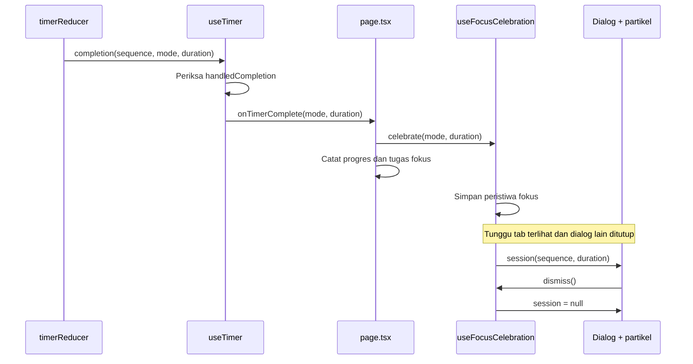

# Deep Dive: perayaan sesi fokus

**Tanggal:** 30 September 2026  
**Fase:** perayaan partikel, popup motivasi, dan pemisahan layanan notifikasi  
**File:** `lib/celebration.ts`, `hooks/useFocusCelebration.ts`, `components/FocusCelebrationDialog.tsx`, `components/ConfettiBurst.tsx`, `services/notifications.ts`, serta integrasi `page.tsx`.

## Gambaran fitur

Setelah fokus selesai secara alami, pengguna mendapat popup berisi menit yang tercatat, pesan motivasi singkat, serta satu ledakan partikel. Menutup popup tidak menambah progres lagi. Sesi istirahat, skip, dan reset tidak menghasilkan perayaan.

Tujuannya memberi pengakuan pada satu sesi yang selesai. Partikel berhenti setelah sekitar 1,7 detik; popup tetap terbuka sampai pengguna menutupnya. Reduce Motion menyembunyikan partikel dan mempertahankan pesan.

### Mengapa dibagi menjadi beberapa file?

Aturan “fokus saja yang dirayakan” hidup di reducer yang dapat diuji tanpa browser. Hook menyambungkan reducer dengan React serta visibilitas halaman. Komponen menangani presentasi. Layanan notifikasi menangani API browser yang mungkin gagal.

Untuk satu toast sederhana, `useState<boolean>` bisa cukup. Di sini dibutuhkan payload durasi, identitas peristiwa untuk memainkan animasi baru, serta penundaan saat tab tersembunyi. State eksplisit membuat perilaku tersebut lebih mudah dipahami.

## Alur end-to-end



## Code walkthrough

### 1. `app/lib/celebration.ts`

Model `FocusCelebration` menyimpan `sequence` dan `duration`. State menyimpan sequence terakhir meskipun dialog sudah ditutup. Aksi berupa union `complete` atau `dismiss`.

```ts
export function celebrationReducer(state: CelebrationState, action: CelebrationAction): CelebrationState {
  if (action.type === "dismiss") return { ...state, session: null };
  if (action.mode !== "focus") return state;

  const sequence = state.sequence + 1;
  return { sequence, session: { sequence, duration: action.duration } };
}
```

Penjelasan tiap baris utama pada cuplikan:

1. Signature menerima state serta aksi dan mengembalikan state berikutnya. Tidak ada React atau browser API di fungsi ini.
2. `dismiss` hanya mengosongkan sesi. Sequence tetap tersimpan agar perayaan berikutnya memiliki identitas baru.
3. Setelah cabang `dismiss` selesai, TypeScript mengetahui aksi adalah `complete`. Mode selain fokus mengembalikan objek state lama.
4. Sequence bertambah untuk satu callback fokus baru.
5. Payload menyimpan durasi yang diberikan timer, sehingga pengaturan baru tidak mengubah durasi sesi yang sudah selesai.

Reducer tidak menghapus duplikasi callback sendiri. Jaminan satu callback berasal dari `handledCompletion` di `useTimer`. Jika kelak completion berasal dari jaringan yang bisa mengirim ulang, tambahkan ID peristiwa sumber dan pemeriksaan idempotensi di batas tersebut.

### 2. `app/hooks/useFocusCelebration.ts`

```ts
const [state, dispatch] = useReducer(celebrationReducer, INITIAL_CELEBRATION);
const visible = useSyncExternalStore(subscribeToVisibility, isPageVisible, serverVisibility);
```

Baris pertama memberi React kepemilikan state perayaan. Baris kedua membaca keadaan halaman yang dimiliki browser. `subscribeToVisibility` memasang listener `visibilitychange` dan mengembalikan fungsi pelepas listener.

`getSnapshot` mengembalikan boolean stabil: apakah halaman terlihat. Snapshot server adalah `false` karena server tidak memiliki document. State awal tidak memiliki sesi, sehingga tidak ada popup pada render pertama.

```ts
return { session: visible ? state.session : null, celebrate, dismiss };
```

State asli tidak dihapus saat tab tersembunyi. Hanya hasil yang diberikan ke UI disembunyikan. Saat browser memberi event bahwa tab terlihat lagi, React membaca snapshot baru dan popup tersedia.

`celebrate` dan `dismiss` dibungkus `useCallback` agar identitas fungsi stabil saat dipakai dalam dependency callback halaman. Hook ini tidak membaca progres tersimpan; reload tidak merayakan sesi lama. Referensi: [useReducer](https://react.dev/reference/react/useReducer) dan [useSyncExternalStore](https://react.dev/reference/react/useSyncExternalStore).

### 3. `app/page.tsx`

Halaman menerima `session`, `celebrate`, dan `dismiss` dari hook. `celebrationOpen` adalah nilai turunan dari adanya sesi serta tidak adanya dialog lain. Nilai itu tidak membutuhkan state tambahan atau Effect untuk disinkronkan.

`onTimerComplete` memanggil perayaan dan mencatat fokus. Saat popup terbuka, handler pintasan halaman berhenti memproses Space, R, S, dan N. Dengan begitu menekan keyboard di modal tidak sekaligus menjalankan timer di belakangnya.

Jika dialog tugas sedang terbuka, peristiwa tetap disimpan tetapi popup belum dirender. Menutup atau menyimpan form membuat `celebrationOpen` menjadi true. State draft tidak dibuang demi perayaan.

### 4. `app/components/FocusCelebrationDialog.tsx`

Props komponen adalah sesi, jumlah sesi fokus yang sudah tercatat, serta callback penutup. `session.duration` menampilkan menit aktual. `messageForSession(completedSessions)` memilih pesan dari data motivasi; teks dapat diubah tanpa menyentuh timer.

`AppDialog` menyediakan title yang dibaca screen reader, fokus modal, Escape, dan tombol tutup. Prop opsional `className` memberi animasi masuk 320 ms khusus pada dialog perayaan. Dinosaurus memakai ilustrasi yang sudah ada, dibungkus tombol “Rayakan lagi” yang dapat digunakan dengan keyboard. Tombol “Istirahat dulu” memanggil `onClose`; tidak memulai sesi, tidak mengubah tugas, dan tidak mencatat progres.

`FocusCelebrationDialog` menyimpan jumlah klik perayaan dalam state lokal `replays`. Klik “Rayakan lagi” menambah nilai ini dengan functional state update. `ConfettiBurst` memiliki key dari sequence sesi dan `replays`: identitas baru memasang elemen partikel baru, sehingga animasi CSS dimulai kembali. Cue dinosaurus juga memakai `replays` untuk mengulang sorakan. State ini tidak memanggil completion timer dan tidak menambah progres.

Hover dan tekan memberi respons visual pada tombol dinosaurus serta tombol istirahat. Semua gerakan terjadi sekali setelah aksi. Reduce Motion menghilangkan partikel, animasi masuk, dan transform tombol; pesan motivasi serta status setelah klik tetap tersedia.

### 5. `app/components/ConfettiBurst.tsx` dan CSS

Ada 36 partikel. Konfigurasinya dibuat sekali di tingkat modul. Posisi ditentukan secara deterministik:

```ts
const angle = (index / 36) * Math.PI * 2;
const distance = 140 + (index % 5) * 32;
```

`index / 36` membagi lingkaran menjadi 36 arah. `2π` adalah satu putaran penuh. `distance` membuat lima jarak berbeda supaya semua partikel tidak membentuk satu lingkaran kaku.

`cos(angle) * distance` adalah perpindahan horizontal; `sin(angle) * distance - 100` adalah perpindahan vertikal yang dinaikkan 100 piksel. CSS custom properties meneruskan posisi, putaran, dan delay ke keyframes.

Animasi memulai partikel dari tengah layar, menyebarkannya, lalu menurunkannya sambil memudar. Delay maksimum 105 ms ditambah durasi 1600 ms membuat seluruh burst selesai sekitar 1,7 detik. Tiga warna berasal dari token desain aplikasi.

Lapisan partikel memiliki `pointer-events: none` agar tidak menutupi klik, `aria-hidden` agar tidak dibaca sebagai konten, dan overflow tersembunyi agar tidak membuat scrollbar. Partikel transparan tetap berada di DOM sampai dialog ditutup, tetapi animasinya tidak berulang.

```css
@media (prefers-reduced-motion: reduce) {
  .confetti-burst { display: none; }
}
```

Ini menghormati preferensi gerak pada perangkat. Popup tetap menyampaikan hasil sesi tanpa animasi. Pelajari [prefers-reduced-motion](https://developer.mozilla.org/en-US/docs/Web/CSS/Reference/At-rules/%40media/prefers-reduced-motion).

### 6. `app/services/notifications.ts`

Saat menyelesaikan fokus, notifikasi browser tidak boleh menyebabkan proses completion melempar error. Karena itu `notifyUser` dipanggil dari hook timer dan hook pengingat melalui satu layanan bersama.

Urutannya: periksa dukungan dan izin; coba service worker; tunggu siap; periksa lagi apakah pesan relevan; kirim. Jika jalur tersebut gagal, coba constructor desktop. Jika keduanya gagal, hasilnya `false`, bukan Promise rejection yang tidak ditangani.

Parameter `isRelevant` digunakan pengingat saat pergi untuk mencegah pesan yang terlambat: pengguna mungkin sudah kembali ketika worker selesai disiapkan. Notifikasi completion menggunakan relevansi default karena sesi memang sudah selesai. Popup dalam halaman tidak membutuhkan izin notifikasi.

Perbedaan desktop dan mobile serta izin browser dijelaskan di [Notifications API](https://developer.mozilla.org/en-US/docs/Web/API/Notifications_API/Using_the_Notifications_API).

## Konsep dan trade-off

| Konsep | Mengapa dipakai | Alternatif |
|---|---|---|
| Peristiwa completion | Perayaan muncul karena peristiwa baru, bukan karena total progres lebih dari nol | Effect yang mengamati total progres bisa salah memicu ketika hydration atau impor data |
| State sementara | Perayaan tidak diputar kembali saat reload | Menyimpan popup memerlukan aturan kedaluwarsa dan status sudah dilihat |
| Sequence sebagai key | Sesi baru memainkan animasi baru | State animasi manual menambah timer serta cleanup yang tidak diperlukan |
| CSS keyframes | Burst kecil tanpa library tambahan atau render tiap frame | Canvas lebih cocok jika jumlah partikel jauh lebih besar atau fisika perlu interaktif |
| Visibilitas browser | Partikel tidak habis dimainkan sebelum pengguna melihatnya | Memainkan langsung lebih sederhana tetapi pengguna tab lain hanya menemukan popup statis |
| Dialog bersama | Fokus dan perilaku keyboard konsisten antarfitur | Menulis modal dengan `div` saja berarti mengelola focus trap serta aksesibilitas sendiri |

## Pengujian dan batas verifikasi

[`celebration.test.mjs`](../tests/celebration.test.mjs) memeriksa fokus saja yang dirayakan, sequence baru setelah dismiss, serta skip/reset tidak menghasilkan completion. [`notifications.test.mjs`](../tests/notifications.test.mjs) memeriksa izin ditolak, fallback worker gagal, relevansi setelah operasi async, dan browser yang gagal menampilkan notifikasi lokal.

Tes layanan memakai browser palsu dan mengembalikan global semula setelah setiap kasus. Tes itu tidak membuktikan izin OS nyata, animasi, atau focus trap di browser. Pemeriksaan lint, typecheck, dan build juga tidak menggantikan checklist manual di [panduan end-to-end](pomodoro-end-to-end-2026-09-30.md#menjalankan-menguji-dan-merilis).

Pada perubahan ini, 15 tes unit, lint, typecheck, dan build produksi berhasil. Pengujian tambahan di Chromium headless memeriksa penyelesaian fokus, skip/reset/istirahat, tidak adanya popup berulang, 36 partikel, lebar ponsel 375 px, fokus keyboard, Reduce Motion, draft form, simulasi visibilitas halaman, serta progres setelah reload. Screenshot ponsel dan desktop juga diperiksa. Uji visibilitas memakai simulasi browser API; notifikasi OS nyata dan penangguhan tab oleh perangkat belum diverifikasi dengan uji tersebut.

## Referensi dan latihan berikutnya

- [Radix Dialog](https://www.radix-ui.com/primitives/docs/components/dialog): pelajari modal, fokus, dan keyboard sebelum menambah dialog lain.
- [React Managing State](https://react.dev/learn/managing-state): latihan menentukan state yang perlu disimpan dan state yang cukup dihitung.
- [TypeScript Narrowing](https://www.typescriptlang.org/docs/handbook/2/narrowing.html): pahami mengapa `action.mode` tersedia setelah cabang `dismiss` dikembalikan.

Latihan: tambahkan pilihan menonaktifkan partikel sambil mempertahankan popup. Simpan preferensinya, lalu uji bahwa completion tetap memperbarui progres. Setelah itu, coba membuat pesan khusus ketika sesi keempat selesai; gunakan informasi siklus, bukan total seumur aplikasi secara keliru.

**Kode terkait:** [`timer.ts`](../app/lib/timer.ts), [`useTimer.ts`](../app/hooks/useTimer.ts), [`motivationalQuotes.ts`](../app/data/motivationalQuotes.ts), [`AppDialog.tsx`](../app/components/AppDialog.tsx), dan [`globals.css`](../app/globals.css).
