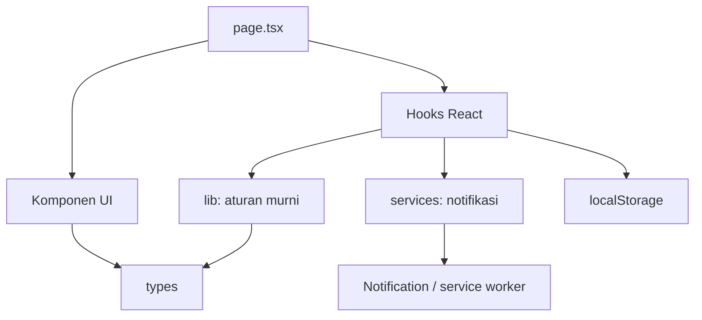

# Deep Dive: Pomodoro end-to-end

**Tanggal:** 30 September 2026  
**Fase:** v2.0, perayaan sesi fokus dan dokumentasi pengembangan  
**Cakupan:** halaman, timer, tugas, penyimpanan, progres, musik, notifikasi, perayaan, pengujian, dan cara merilis.

Panduan ini memakai pendekatan AntiVibe: memahami fungsi kode, alasan keputusan, kapan pola itu berguna, serta alternatifnya. Baca sambil membuka file yang ditautkan. Untuk bedah fitur baru yang lebih rinci, lanjutkan ke [perayaan sesi fokus](focus-celebration-2026-09-30.md).

## Gambaran aplikasi

Pomodoro adalah aplikasi Next.js dengan halaman interaktif di browser. Pengguna memilih tugas, menjalankan timer, lalu mendapat catatan progres dan perayaan setelah fokus selesai. Data pengguna tersimpan di browser yang digunakan. Musik berasal dari iframe YouTube. Endpoint `/health` memeriksa apakah server merespons.

Tidak ada akun, database server, sinkronisasi antarperangkat, atau penjadwal notifikasi jarak jauh. Konsekuensinya: menutup tab menghentikan timer JavaScript dan pengingat; membersihkan penyimpanan browser menghapus data lokal.

### Mengapa arsitekturnya seperti ini?

Kebutuhan saat ini cukup ditangani dengan fungsi murni, hooks, komponen, dan satu layanan notifikasi. Aturan timer dapat diuji tanpa menjalankan React. Browser API dapat berubah atau gagal tanpa mengubah aturan penyelesaian sesi. Tampilan perayaan bisa diganti tanpa menyentuh perhitungan progres.

Ini penerapan pemisahan tanggung jawab pada ukuran aplikasi saat ini. Belum diperlukan dependency injection container, kelas repository untuk setiap entitas, atau event bus global. Jika kelak aplikasi memiliki login dan sinkronisasi, batas penyimpanan perlu dikembangkan lebih jauh.

## Peta kode dan arah dependensi

| Lapisan | File utama | Tanggung jawab |
|---|---|---|
| Model | [`app/types/index.ts`](../app/types/index.ts) | Bentuk tugas, mode timer, pengaturan, dan progres |
| Aturan murni | [`timer.ts`](../app/lib/timer.ts), [`progress.ts`](../app/lib/progress.ts), [`stats.ts`](../app/lib/stats.ts), [`celebration.ts`](../app/lib/celebration.ts) | Menghitung keadaan berikutnya tanpa DOM atau penyimpanan |
| Layanan browser | [`services/notifications.ts`](../app/services/notifications.ts) | Mengirim notifikasi melalui API perangkat yang tersedia |
| Hooks | [`useTimer.ts`](../app/hooks/useTimer.ts), [`useLocalStorage.ts`](../app/hooks/useLocalStorage.ts), [`useFocusCelebration.ts`](../app/hooks/useFocusCelebration.ts), [`useAwayReminder.ts`](../app/hooks/useAwayReminder.ts) | Menghubungkan React dengan aturan serta efek browser |
| UI | [`app/components`](../app/components) | Menampilkan data dan meneruskan tindakan pengguna |
| Penghubung fitur | [`app/page.tsx`](../app/page.tsx) | Menyambungkan timer, tugas, progres, dan dialog |
| Server | [`layout.tsx`](../app/layout.tsx), [`health/route.ts`](../app/health/route.ts) | Kerangka halaman, metadata, dan health check |



Aturan di `lib` tidak mengimpor hooks atau komponen. Itulah batas yang perlu dijaga ketika menambah fitur. Kode penyimpanan dan notifikasi bukan aturan bisnis; tempatnya di hook atau layanan browser.

## Code walkthrough: satu sesi dari awal sampai selesai

### 1. Server mengirim halaman, browser mengaktifkannya

[`layout.tsx`](../app/layout.tsx) memasang metadata, bahasa Indonesia, dan CSS global. [`page.tsx`](../app/page.tsx) memakai `"use client"` karena membutuhkan state dan interaksi browser. Komponen yang diimpornya berada dalam batas client tersebut.

Render pertama memakai nilai awal agar HTML yang dikirim server cocok dengan render pertama di browser. Setelah mount, `useLocalStorage` membaca data yang tersimpan. Perbedaan server dan browser serta proses hydration dijelaskan di [dokumentasi Next.js](https://nextjs.org/docs/app/getting-started/server-and-client-components).

### 2. Memilih tugas dan memulai timer

[`TaskList.tsx`](../app/components/TaskList.tsx) meneruskan ID tugas pilihan ke halaman. Halaman menyimpan `activeTaskId`. [`TaskModal.tsx`](../app/components/TaskModal.tsx) mengelola draft judul, prioritas, catatan, serta perkiraan sesi; `saveTask` di halaman membuat UUID untuk tugas baru atau memperbarui tugas lama.

[`TimerCard.tsx`](../app/components/TimerCard.tsx) menerima hasil `useTimer`. Tombol utama memanggil `start` atau `pause`. Hook meneruskan aksi ke reducer; komponen tidak menghitung waktu sendiri.

```ts
const timer = useTimer(settings, onTimerComplete, ringtoneId, ringtoneRepeat);
```

Argumen pertama adalah aturan durasi. Argumen kedua adalah tindakan aplikasi setelah sesi selesai. Dua argumen terakhir memilih bunyi. Perbedaan ini membuat tanggung jawab timer tetap terbatas.

### 3. Reducer menyimpan deadline

Di [`timer.ts`](../app/lib/timer.ts), aksi `start` menyimpan waktu akhir:

```ts
deadline: action.now + state.timeRemaining * 1000
```

`timeRemaining` memakai detik, sedangkan `Date.now()` memakai milidetik. Perkalian `1000` menyamakan satuan. Misalnya mulai pada waktu `0` dengan 25 menit: deadline adalah `1_500_000` milidetik.

Saat `tick` datang, reducer menghitung:

```ts
const remaining = Math.max(0, Math.ceil((state.deadline - action.now) / 1000));
```

Urutan operasi: cari selisih deadline dan waktu saat ini; ubah ke detik; bulatkan ke atas agar angka tidak mencapai nol sebelum waktunya; batasi nilai terendah ke nol.

Hook memanggil `tick` setiap detik dan saat halaman kembali aktif. Jika browser menunda interval, tick berikutnya menggunakan jam aktual. Sistem tidak mengasumsikan bahwa setiap interval pasti datang tepat satu detik. Perubahan jam sistem tetap dapat memengaruhi selisih tersebut.

### 4. Sesi selesai menghasilkan satu peristiwa

`transition` di reducer mengganti mode, mempersiapkan durasi berikutnya, dan menghentikan timer. Penyelesaian memiliki `completion.sequence`, `mode` lama, dan `duration` sesi yang benar-benar dijalankan.

Nilai sequence membantu `useTimer` membedakan peristiwa baru dari render ulang. `handledCompletion` adalah ref yang menyimpan sequence terakhir yang sudah diproses. Ref ini tidak memicu render; lihat [perbedaan event dan Effect](https://react.dev/learn/separating-events-from-effects) untuk memahami batas efek tersebut.

`skip` menghasilkan `completion: null`. Karena itu melewati sesi tidak menambah progres atau membuka perayaan. Istirahat yang selesai menghasilkan completion juga, tetapi halaman dan reducer perayaan hanya mencatat fokus.

### 5. Halaman menghubungkan hasil ke fitur lain

`onTimerComplete` di [`page.tsx`](../app/page.tsx) melakukan tiga pekerjaan untuk fokus:

1. Memanggil `celebrate(mode, duration)` untuk membuat peristiwa perayaan.
2. Memanggil `recordFocusSession` melalui pembaruan state berdasarkan nilai sebelumnya.
3. Menambah `actualPomodoros` pada tugas aktif dan menyelesaikannya jika perkiraan sesi terpenuhi.

```ts
setProgress(previous => recordFocusSession(previous, duration, new Date()));
```

`previous` adalah state terbaru yang diberikan React, bukan salinan progres dari render lama. Fungsi ini mengembalikan objek baru. Jangan mengirim notifikasi atau memainkan bunyi di dalam updater, karena updater harus tetap murni.

**Perilaku saat ini:** tugas yang mendapat kredit adalah tugas aktif pada saat sesi selesai. Jika kelak Anda ingin mengunci tugas sejak sesi dimulai, simpan `taskId` pada awal sesi dan teruskan ID itu dalam peristiwa completion.

### 6. Pop-up dan partikel muncul

[`useFocusCelebration.ts`](../app/hooks/useFocusCelebration.ts) menyimpan perayaan sebagai state sementara. [`FocusCelebrationDialog.tsx`](../app/components/FocusCelebrationDialog.tsx) menampilkan durasi aktual, pesan `messageForSession`, serta tombol menutup dialog. Partikel berada di [`ConfettiBurst.tsx`](../app/components/ConfettiBurst.tsx).

Jika tab tersembunyi, hook menyimpan perayaannya sampai tab terlihat. Jika dialog tugas, pengaturan, atau progres terbuka, halaman menunggu dialog itu ditutup. Popup tidak memulai istirahat otomatis. Tombol “Istirahat dulu” menutupnya; pengguna menekan tombol timer untuk menjalankan istirahat.

Detail algoritma partikel, sequence, dan aksesibilitas tersedia di [bedah perayaan](focus-celebration-2026-09-30.md).

## Code walkthrough: progres dan kalender

[`recordFocusSession`](../app/lib/progress.ts) menerima progres lama, menit fokus, dan tanggal sebagai argumen. Fungsi memperbarui total menit, jumlah sesi, streak, dan satu entri harian. Parameter tanggal memudahkan pengujian tanpa bergantung pada hari saat tes dijalankan.

| Kondisi tanggal | Hasil streak |
|---|---|
| Fokus lagi pada tanggal yang sama | Streak tetap |
| Fokus pada tanggal berikutnya | Streak bertambah satu |
| Tidak ada tanggal lama atau ada jeda hari | Streak menjadi satu |

[`stats.ts`](../app/lib/stats.ts) mengubah `dailyStats` menjadi data kalender dan histogram. `Map` dipakai untuk mencari menit per tanggal. `focusIntensity` menetapkan tingkat warna: nol, sampai 30 menit, sampai 60 menit, dan lebih dari 60 menit.

`focusActivityData` mencakup 12 bulan kalender termasuk bulan berjalan, dari tanggal 1 pada bulan sebelas bulan sebelumnya sampai hari ini. Grid menambahkan sel pelengkap agar minggu selalu Senin sampai Minggu; sel di luar rentang disembunyikan. Ini bukan selalu tepat 365 hari.

`focusChartData` menampilkan tujuh hari untuk minggu, kelompok tanggal 1–7 dan seterusnya untuk bulan berjalan, serta 12 bulan untuk tahun berjalan. [`ProgressModal.tsx`](../app/components/ProgressModal.tsx) menyimpan batang yang dipilih agar menitnya dapat dibaca.

**Tanggal saat ini memakai UTC**, termasuk statistik dan label kalender, untuk menjaga arti data lama. Di Jakarta, fokus pukul 01.00 tanggal 2 masih tercatat sebagai tanggal 1 UTC. Jika ingin hari lokal, ubah pembuat kunci tanggal, pencarian statistik, label, dan tes bersama-sama; buat migrasi yang jelas untuk data lama.

## Code walkthrough: penyimpanan

[`useLocalStorage<T>`](../app/hooks/useLocalStorage.ts) adalah hook generik: mekanisme membaca dan menulis sama untuk tugas, pengaturan, atau progres, tetapi tipe `T` berbeda. Rincian generic dibahas di [TypeScript Handbook](https://www.typescriptlang.org/docs/handbook/2/generics.html).

| Bagian hook | Alasan |
|---|---|
| `useState(initialValue)` | Render pertama deterministik |
| Effect membaca JSON setelah mount | `window` hanya tersedia di browser |
| Flag `hydrated` | Nilai awal tidak menimpa data lama sebelum pembacaan selesai |
| Effect menulis setelah hydrated | Setiap perubahan state disimpan |
| `try/catch` | JSON rusak atau penyimpanan gagal tidak langsung menjatuhkan halaman |

Kunci lokal: `pomodoro-tasks`, `pomodoro-settings`, `pomodoro-progress`, `pomodoro-active-task`, `pomodoro-custom-playlists`, `pomodoro-ringtone`, `pomodoro-ringtone-repeat`, dan `pomodoro-away-reminders`.

Timer yang sedang berjalan, mode sementara, draft form, dan dialog perayaan tidak disimpan. Reload halaman mengembalikan timer ke keadaan awal; progres yang sudah tersimpan tetap ada. Jangan mengaktifkan popup berdasarkan jumlah sesi tersimpan, karena itu akan mengulang perayaan lama saat reload.

Hook saat ini menangkap kegagalan parsing tetapi belum memvalidasi seluruh bentuk JSON saat runtime. TypeScript memeriksa kode, bukan isi localStorage. Saat format berubah, tambahkan `schemaVersion`, validator, dan migrasi sebelum mengganti field. Jangan langsung mengganti nama kunci lalu menganggap semua pengguna memiliki data baru.

`localStorage` bersifat lokal untuk origin dan browser; bukan database terenkripsi atau sumber kebenaran multiuser. Pelajari batasnya lewat [MDN localStorage](https://developer.mozilla.org/en-US/docs/Web/API/Window/localStorage). Untuk data besar atau sinkronisasi, pertimbangkan IndexedDB atau backend dengan autentikasi.

## Code walkthrough: notifikasi dan bunyi

[`useTimer.ts`](../app/hooks/useTimer.ts) memainkan ringtone pada completion dan mencoba notifikasi. [`ringtones.ts`](../app/data/ringtones.ts) membuat bunyi dengan Web Audio, bukan file audio yang harus diunduh. Pengaturan menyimpan pilihan ringtone serta jumlah pengulangannya. Pelajari primitive audio melalui [Web Audio API](https://developer.mozilla.org/en-US/docs/Web/API/Web_Audio_API).

[`useAwayReminder.ts`](../app/hooks/useAwayReminder.ts) mengamati halaman tersembunyi atau jendela yang kehilangan fokus. Ia menjadwalkan pengingat setiap 10 menit selama halaman tetap terbuka. Pengguna kembali: timeout dibatalkan dan hitungan pesan direset. Callback yang terlambat menjadwalkan pengingat berikutnya dari waktu sekarang, sehingga tidak mengirim semua pengingat yang terlewat sekaligus.

Kedua hook memakai [`notifyUser`](../app/services/notifications.ts). Layanan ini memeriksa izin, mencoba service worker, lalu mencoba notifikasi desktop jika jalur pertama gagal. Hasil `false` berarti notifikasi tidak ditampilkan; kegagalan itu tidak menghentikan pencatatan progres atau pop-up dalam halaman.

Callback `isRelevant` diperiksa lagi setelah operasi async. Contoh: pengguna sudah kembali sebelum service worker siap, sehingga pengingat pergi tidak lagi relevan. [`notifications-sw.js`](../public/notifications-sw.js) menangani klik notifikasi dan memfokuskan halaman aplikasi.

Izin harus diberikan melalui interaksi pengguna. HTTPS diperlukan pada situs publik; dukungan berbeda antarbrowser. Service worker ini bukan penjadwal push: setelah tab ditutup, tidak ada kode halaman yang menjadwalkan pengingat. Tab yang dibekukan sistem juga dapat menunda notifikasi. Lihat [panduan Notifications API](https://developer.mozilla.org/en-US/docs/Web/API/Notifications_API/Using_the_Notifications_API).

## Code walkthrough: musik, pengaturan, dan error

[`MusicPlayer.tsx`](../app/components/MusicPlayer.tsx) menerima pilihan musik tersimpan, menyimpan pilihan aktif sementara, dan menampilkan iframe YouTube. `extractYouTubeId` menerima ID 11 karakter atau URL HTTPS dari host YouTube yang dikenali. URL tidak langsung dimasukkan ke iframe; aplikasi membangun URL embed dari ID yang sudah diperiksa.

Autoplay tetap dapat diblokir browser atau video. Pemutar menyediakan tautan ke YouTube sebagai alternatif. Validasi URL saat ini berada di komponen; jika kelak digunakan untuk impor atau backend, pindahkan parser ke `lib` dan uji sebagai fungsi murni.

[`SettingsModal.tsx`](../app/components/SettingsModal.tsx) memakai draft untuk durasi timer. “Simpan” menerapkannya; “Batal” membuang draft. Ringtone dan pengingat saat pergi diterapkan langsung ketika kontrolnya diubah. Perbedaan ini perlu diingat jika nanti Anda ingin membuat semua pengaturan bersifat transaksional.

[`AppDialog.tsx`](../app/components/AppDialog.tsx) membungkus Radix Dialog. Judul, tombol tutup, scroll, fokus, dan Escape dikelola bersama agar setiap modal tidak menulis ulang perilaku tersebut. Wrapper juga menyimpan elemen yang sebelumnya fokus. Referensi aksesibilitas ada di [Radix Dialog](https://www.radix-ui.com/primitives/docs/components/dialog).

[`error.tsx`](../app/error.tsx) menyediakan tampilan coba lagi untuk error render. Ia tidak otomatis menangkap semua Promise atau error di event handler. Karena itu kegagalan notifikasi ditangani oleh layanan notifikasi sendiri. `/health` hanya liveness check server, bukan tes bahwa YouTube, izin notifikasi, atau data browser berfungsi.

## Konsep, kapan dipakai, dan alternatif

| Konsep | Apa dan mengapa di proyek ini | Kapan cocok | Alternatif dan biaya |
|---|---|---|---|
| Reducer / mesin keadaan | Aksi eksplisit menghitung state berikutnya; transisi timer dapat diuji | Banyak aksi memengaruhi beberapa field sekaligus | `useState` lebih pendek untuk toggle sederhana; state machine library berguna saat alur bercabang jauh lebih banyak |
| Fungsi murni | Input sama menghasilkan output sama; tidak membaca DOM atau jam sendiri | Perhitungan progres, durasi, grafik | Effect yang mencampur semuanya sulit diuji dan mudah mengulang efek |
| Immutable updates | Objek lama tidak diubah; React menerima objek baru | State React dan reducer | Mutasi lokal boleh untuk objek baru yang belum dibagikan, tetapi jangan memutasi state yang diterima |
| Hook khusus | Menyembunyikan langganan, cleanup, dan interaksi React | Perilaku dipakai halaman dan cukup mandiri | Menulis seluruhnya di halaman mengurangi file, tetapi cepat menumpuk tanggung jawab |
| Layanan sebagai adapter | API notifikasi dibungkus satu fungsi agar kegagalannya terisolasi | Integrasi browser atau layanan eksternal | Memanggil API di semua komponen mengulang penanganan izin dan fallback |
| Discriminated union | `action.type` membedakan bentuk aksi dan field yang tersedia | Reducer dengan beberapa tipe aksi | Banyak field opsional pada satu interface membuat kombinasi tidak valid lebih mudah terbentuk |
| State sementara vs tersimpan | Perayaan hanya untuk peristiwa baru, progres bertahan saat reload | Toast, modal, draft, pilihan pengguna | Menyimpan semua UI ke localStorage dapat membuka kembali modal yang sudah tidak relevan |

Pelajari union di [TypeScript Narrowing](https://www.typescriptlang.org/docs/handbook/2/narrowing.html), lalu bandingkan batas state dengan [React Managing State](https://react.dev/learn/managing-state). Tidak perlu menerapkan semua pola ke setiap fungsi; pilih berdasarkan masalah yang sedang tumbuh.

## Performa dan alasan keputusan

Panel progres dan musik memakai `next/dynamic` sehingga kode panel dapat dimuat saat dibutuhkan. Timer tetap berjalan melalui deadline. Partikel hanya terdiri dari 36 elemen, dibentuk sekali di luar komponen, dan dianimasikan dengan CSS; tidak ada pembaruan state setiap frame.

`memo` pada beberapa komponen dapat melewatkan render jika props sama. Timer tetap mengubah props tiap detik, jadi `memo` bukan jaminan timer tidak render. Gunakan profiler sebelum menambah memoization atau memindahkan state ke store global.

Tidak ada benchmark yang membuktikan persentase peningkatan performa. Tes memastikan perilaku; pengukuran performa membutuhkan profiler serta data nyata.

## Menjalankan, menguji, dan merilis

Gunakan Node.js yang memenuhi persyaratan proyek, lalu:

```bash
npm ci
npm run dev
```

Server dev tersedia di `http://localhost:3001`. Port 3000 dipakai WhatsApp bridge Hermes pada mesin ini. Bridge tersebut mencoba menghentikan proses yang sedang mendengarkan pada portnya saat reconnect; memakai port terpisah mencegah Pomodoro menerima SIGTERM (exit code 143).

Untuk lingkungan ini, perintah shell dibungkus `rtk` sesuai instruksi proyek. Perintah npm yang mendasarinya tetap sama.

| Perintah | Apa yang diperiksa | Apa yang belum dibuktikan |
|---|---|---|
| `npm test` | Aturan timer, progres, motivasi, perayaan, fallback notifikasi | Tampilan browser dan izin OS nyata |
| `npm run lint` | Aturan penulisan serta penggunaan hooks | Logika bisnis benar untuk seluruh kasus |
| `npm run typecheck` | Kesesuaian tipe TypeScript | JSON pengguna valid saat runtime |
| `npm run build` | Kompilasi produksi dan pembuatan route | Semua interaksi di perangkat pengguna |

Tes berada di [`tests`](../tests) dan memakai [Node test runner](https://nodejs.org/api/test.html), `assert`, serta `tsx` untuk mengimpor TypeScript. Tes timer memakai waktu buatan, sehingga 25 menit dapat diperiksa langsung tanpa menunggu 25 menit.

Sebelum merilis, periksa manual:

1. Jalankan fokus satu menit. Completion harus menambah progres sekali, mengisi love, membuka popup, lalu berhenti di mode istirahat.
2. Coba `skip` dan `reset`. Keduanya tidak boleh membuka perayaan atau menambah sesi selesai.
3. Biarkan sesi selesai di tab lain. Saat kembali, popup harus muncul.
4. Biarkan form tugas terbuka sampai sesi selesai. Isian tetap ada; popup muncul setelah form ditutup.
5. Gunakan Tab, Shift+Tab, Escape, dan tombol tutup. Fokus harus tetap dapat digunakan.
6. Aktifkan Reduce Motion perangkat. Pesan tetap muncul, partikel tidak dimainkan.
7. Reload untuk memeriksa tugas dan progres. Timer serta perayaan tidak dilanjutkan dari state sementara.

Build dan server produksi:

```bash
npm run build
npm run start -- --port 3001
curl -i http://localhost:3001/health
```

`/health` harus mengembalikan `200`, `{"status":"ok"}`, dan `Cache-Control: no-store`. Untuk hosting Node atau Vercel, gunakan build dan versi dependensi dari lockfile. Ikuti [panduan deployment Next.js](https://nextjs.org/docs/app/getting-started/deploying) untuk pilihan lingkungan; deploy bukan bagian otomatis dari penambahan fitur.

## Cara menambah fitur berikutnya

### Mengubah teks atau tampilan perayaan

Ubah `sessionMessages` di `app/data/motivationalQuotes.ts`, lalu gaya perayaan di `globals.css`. `messageForSession` mengulang pesan berdasarkan jumlah sesi selesai. Jika Anda mengubah jumlah pesan, sesuaikan tes putaran pesan yang saat ini memakai empat pesan.

### Menambah pengaturan “Perayaan aktif”

Tambahkan preferensi di `useAppPersistence`, sambungkan checkbox pengaturan, lalu putuskan apakah nonaktif berarti hanya partikel mati atau popup juga mati. Uji aturan yang dipilih. Jangan menonaktifkan pencatatan progres bersamaan dengan tampilan perayaan.

### Menambah target fokus harian

Tambahkan fungsi murni untuk menghitung sisa menit dari statistik hari ini. Uji target tercapai, lebih dari target, dan data kosong. UI menerima hasil hitungan; jangan menghitung tanggal dengan cara berbeda di beberapa komponen.

### Menambah akun dan sinkronisasi

Tentukan dulu sumber kebenaran data. Backend membutuhkan autentikasi, validasi input, ID peristiwa sesi, dan strategi konflik. Mengirim ulang completion saat jaringan pulih dapat menggandakan progres jika server tidak memeriksa ID peristiwa yang sama. Simpan antrian sesi untuk offline dan sediakan migrasi data lokal ke akun.

`useAppPersistence` adalah titik awal integrasi, bukan repository server yang sudah lengkap. Operasi beberapa kunci localStorage saat ini juga tidak bersifat transaksi atomik. Jika pencatatan tugas dan progres harus selalu bersamaan, gabungkan state atau gunakan penyimpanan yang mendukung transaksi.

## Jalur belajar dan latihan

1. **Model dan reducer:** baca `types/index.ts`, lalu `timer.ts`. Gambar state awal, running, paused, dan break. Prediksi hasil `tick` sebelum menjalankan tes.
2. **Data dan immutability:** baca `progress.ts`. Tambahkan tes dua sesi pada hari yang sama dan satu sesi setelah jeda hari.
3. **React dan browser:** baca `useTimer.ts` serta `useLocalStorage.ts`. Jelaskan sendiri mengapa interval butuh cleanup dan mengapa localStorage dibaca setelah mount.
4. **Peristiwa dan UI:** ikuti `onTimerComplete` sampai reducer perayaan dan dialog. Ubah pesan, lalu tambahkan preferensi partikel sebagai latihan.
5. **Efek async:** baca `notifications.ts`. Simulasikan service worker gagal dan pengguna kembali sebelum notifikasi siap; periksa tesnya.
6. **Integrasi:** jalankan pemeriksaan produksi dan checklist manual. Setelah itu baru menambah backend atau store global jika kebutuhan memerlukannya.

## Referensi belajar

- [React useReducer](https://react.dev/reference/react/useReducer): menulis reducer dan memahami state berikutnya.
- [React useSyncExternalStore](https://react.dev/reference/react/useSyncExternalStore): berlangganan pada state browser di luar React.
- [React Separating Events from Effects](https://react.dev/learn/separating-events-from-effects): membedakan tindakan pengguna dari sinkronisasi sistem luar.
- [React Managing State](https://react.dev/learn/managing-state): tutorial resmi untuk memilih lokasi state dan memecah komponen.
- [TypeScript Generics](https://www.typescriptlang.org/docs/handbook/2/generics.html) dan [Narrowing](https://www.typescriptlang.org/docs/handbook/2/narrowing.html): membaca tipe hook dan aksi reducer.
- [MDN Reduced Motion](https://developer.mozilla.org/en-US/docs/Web/CSS/Reference/At-rules/%40media/prefers-reduced-motion): menyesuaikan animasi dengan preferensi perangkat.

**Kode terkait:** [ringkasan arsitektur](../docs/ARCHITECTURE.md), [arah desain](../DESIGN.md), [perayaan sesi](focus-celebration-2026-09-30.md), dan [README](../README.md).

Dokumentasi ini menggambarkan implementasi pada tanggal di atas. Saat mengganti aturan sesi atau penyimpanan, perbarui contoh dan tes bersamaan dengan kode.
